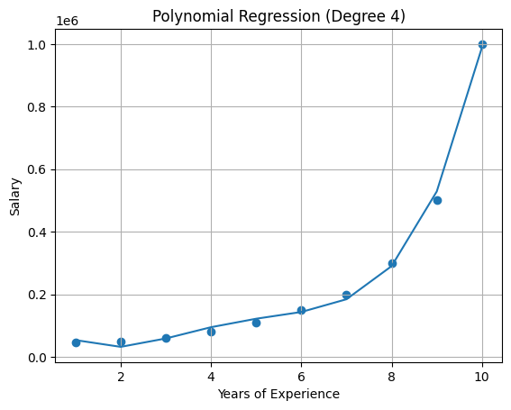

# Program 03: Polynomial Regression

## Question 3
Implement Polynomial Regression to predict Salary based on Position Level (Years of Experience)

## 📂 Dataset

File: 'position_salaries.csv'

Columns:

- Position
- Level (Years of Experience)
- Salary

## output
    
    Intercept: 184166.66666697623
    
    Coefficients: [      0.   -211002.33100264   94765.44289054  -15463.2867133  890.15151515]
    

