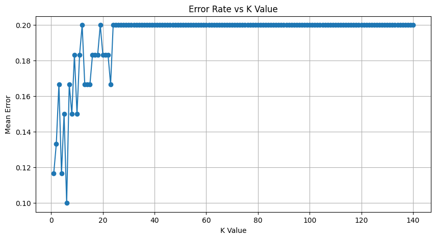

# Program 06: K-Nearest Neighbors (KNN) Classification

## Question 6
Implement K-Nearest Neighbors (KNN) algorithm to predict whether a person has diabetes based on medical attributes.

## 📂 Dataset

File: 'diabetes.csv'

Columns:

1. Pregnancies
2. Glucose
3. BloodPressure
4. SkinThickness
5. Insulin
6. BMI
7. DiabetesPedigreeFunction
8. Age
9. Outcome

Where:
- Outcome = 1 → Diabetic
- Outcome = 0 → Non-Diabetic

## Output
    Predicted values: [0 0 0 1 0 0 0 0 0 0 0 0 0 0 0 0 0 0 0 0 0 1 0 0 1 0 0 1 0 0 0 0 1 0 0 0 1
     0 0 1 0 0 0 0 0 0 0 0 1 1 0 1 0 0 0 0 0 0 0 0]
    Accuracy: 83.33333333333334
    Confusion Matrix:
     [[44  4]
     [ 6  6]]
    Classification Report:
                   precision    recall  f1-score   support
    
               0       0.88      0.92      0.90        48
               1       0.60      0.50      0.55        12
    
        accuracy                           0.83        60
       macro avg       0.74      0.71      0.72        60
    weighted avg       0.82      0.83      0.83        60

